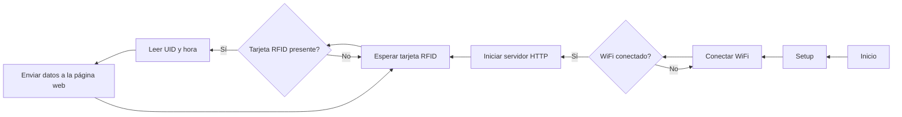

# Practica 6.C (Mejora de nota): SD, RFID y pagina web.
## Objetivo: 
## Materiales: 
- ESP32-S3
- SD + funda
- Lector RFID
- Librerias: 
```
    lib_deps =
    SD
    MFRC522
```
## Procedimiento: 
### Código principal:
```cpp
    #include <Arduino.h>
    #include <SPI.h>
    #include <MFRC522.h>
    #include <SD.h>
    #include <WiFi.h>
    #include <WebServer.h>
    #include <time.h>

    #define SS_PIN 5 // Pin del ESP8266/ESP32 conectado al SS del MFRC522
    #define RST_PIN 21 // Pin del ESP8266/ESP32 conectado al RST del MFRC522
    // #define MFRC522_SS_PIN 10  // Pin de Slave Select para el lector RFID
    #define MFRC522_RST_PIN 21 // Pin de reset para el lector RFID
    // #define SD_SS_PIN 5        // Pin de Slave Select para la tarjeta SD

    #define MOSI_PIN 13 // Pin MOSI
    #define MISO_PIN 12 // Pin MISO
    #define SCK_PIN 11  // Pin SCK

    #define WIFI_SSID "RedmiNuria"
    #define WIFI_PASSWORD "Patata123"
    // #define SERVER_IP "192.168.1.100" // Cambiar a la dirección IP de tu servidor web
    #define SERVER_PORT 80

    String obtenerHora();
    void enviarDatosWeb(String uid, String hora);
    void handleRoot();
    //void escribirEnArchivo(String uid, String hora);
    //void inicializarArchivo();

    WebServer server(80); // Object of WebServer(HTTP port, 80 is defult)
    MFRC522 mfrc522(SS_PIN, RST_PIN); // Crear instancia del lector RFID
    File archivo;

    void setup() {
    Serial.begin(115200);
    SPI.begin();       // Inicializar bus SPI
    mfrc522.PCD_Init(); // Inicializar lector RFID

    // Inicializar conexión WiFi
    WiFi.begin(WIFI_SSID, WIFI_PASSWORD);
    while (WiFi.status() != WL_CONNECTED) {
        delay(1000);
        Serial.println("Conectando a WiFi...");
    }
    Serial.println("Conectado a WiFi!");
    Serial.print("Dirección IP: ");
    Serial.println(WiFi.localIP());

    server.on("/", handleRoot);
    server.begin();
    Serial.println("HTTP server started");
    delay(100);

    // Inicializar archivo de log
    //inicializarArchivo();
    }

    void loop() {
    // Verificar si hay una tarjeta RFID presente
    if (mfrc522.PICC_IsNewCardPresent() && mfrc522.PICC_ReadCardSerial()) {
        // Leer UID de la tarjeta RFID
        String uid = "";
        for (byte i = 0; i < mfrc522.uid.size; i++) {
        uid.concat(String(mfrc522.uid.uidByte[i] < 0x10 ? " 0" : " "));
        uid.concat(String(mfrc522.uid.uidByte[i], HEX));
        }
        uid.toUpperCase();

        // Obtener la hora actual
        String hora = obtenerHora();

        // Escribir datos en el archivo de log
        //escribirEnArchivo(uid, hora);

        // Enviar datos a la página web
        enviarDatosWeb(uid, hora);
    }
    }

    void enviarDatosWeb(String uid, String hora) {
    // Establecer la conexión con el servidor
    WiFiClient client;
    if (!client.connect(WiFi.localIP(), SERVER_PORT)) {
        Serial.println("Error al conectar con el servidor");
        return;
    }

    // Construir el mensaje HTTP
    String mensaje = "GET /enviar_datos?uid=" + uid + "&hora=" + hora + " HTTP/1.1\r\n";
    mensaje += "Host: " + String(WiFi.localIP()) + "\r\n";
    mensaje += "Connection: close\r\n\r\n";

    // Enviar el mensaje HTTP
    client.print(mensaje);
    delay(100); // Esperar un momento para que se envíe completamente

    // Leer y mostrar la respuesta del servidor
    while (client.available()) {
        String line = client.readStringUntil('\r');
        Serial.print(line);
    }
    }

    void inicializarArchivo() {
    archivo = SD.open("/fichero.log", FILE_WRITE);
    if (!archivo) {
        Serial.println("Error al abrir el archivo");
        return;
    }
    archivo.println("Inicio de registro:");
    archivo.close();
    }

    void escribirEnArchivo(String uid, String hora) {
    archivo = SD.open("/fichero.log", FILE_APPEND);
    if (!archivo) {
        Serial.println("Error al abrir el archivo");
        return;
    }
    archivo.println("UID: " + uid + " - Hora: " + hora);
    archivo.close();
    }

    String obtenerHora() {
    struct tm timeinfo;
    if (!getLocalTime(&timeinfo)) {
        Serial.println("Error al obtener la hora");
        return "";
    }

    char hora[20];
    strftime(hora, sizeof(hora), "%Y-%m-%d %H:%M:%S", &timeinfo);
    return String(hora);
    }
                        
    void handleRoot() {
    server.send(200, "text/html", paginaHTML);
    }
```
**Descripción:**
Implementa un sistema de lectura de tarjetas RFID utilizando un módulo MFRC522 y un microcontrolador ESP8266/ESP32, junto con funcionalidades de red para enviar datos a un servidor web.<br>
El proceso comienza con la inicialización de los periféricos y la conexión WiFi. Una vez conectado a la red, el dispositivo espera la detección de una tarjeta RFID. Cuando se presenta una tarjeta, se lee su UID y se obtiene la hora del sistema. Luego, estos datos se registran en un archivo de registro local y se envían al servidor web mediante una solicitud HTTP GET.<br>
La función ``enviarDatosWeb`` establece una conexión con el servidor y construye un mensaje HTTP que contiene el UID y la hora como parámetros. Este mensaje se envía al servidor, y luego se espera y muestra la respuesta del servidor.<br>
El archivo de registro se inicializa al inicio del programa y se escribe en él cada vez que se detecta una tarjeta RFID, utilizando las funciones ``inicializarArchivo`` y ``escribirEnArchivo``.<br>
La hora actual se obtiene utilizando la función ``obtenerHora``, que utiliza la biblioteca ``time.h`` para obtener la hora local del sistema y formatearla como una cadena de caracteres.<br>
Finalmente, la función ``handleRoot`` maneja las solicitudes al servidor web y responde con una página HTML, la cual describiré más tarde.<br>
### Código página web:
```html
    String paginaHTML = "<!DOCTYPE html>\
                        <html>\
                        <head>\
                        <meta charset='UTF-8'>\
                        <meta name='viewport' content='width=device-width, initial-scale=1.0'>\
                        <title>Información RFID</title>\
                        <script>\
                        function actualizarDatos(uid, hora) {\
                            document.getElementById('uid').innerHTML = uid;\
                            document.getElementById('hora').innerHTML = hora;\
                        }\
                        </script>\
                        </head>\
                        <body>\
                        <h1>Información RFID</h1>\
                        <p>UID: <span id='uid'></span></p>\
                        <p>Hora: <span id='hora'></span></p>\
                        </body>\
                        </html>";
```
**Descripción:**
Proporciona información sobre la última tarjeta RFID detectada y la hora en que se registró.<br>
En la parte superior, hay un encabezado que indica "Información RFID". A continuación, hay dos párrafos etiquetados como "UID" y "Hora", seguidos de espacios reservados que se llenan dinámicamente con la información actualizada.<br>
La sección ``<script>`` de la página se utiliza para actualizar estos espacios reservados con los datos de UID y hora proporcionados. La función ``actualizarDatos(uid, hora)`` toma dos argumentos (el UID y la hora) y los establece como contenido de los elementos HTML con los IDs correspondientes: uid y hora. Esto permite que la página web muestre los datos más recientes sin necesidad de recargarla.<br>
### Diagrama de flujos:

### Puerto serie: 
```
    Conectando a WiFi...
    Conectado a WiFi!
    Dirección IP: 192.168.1.101
    HTTP server started
```
## Conclusión:
Al detectar una tarjeta RFID, el sistema registra su identificador único (UID) y la hora actual en un archivo de registro y envía estos datos a un servidor web.